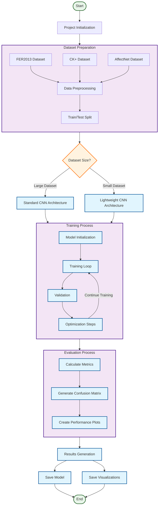

```mermaid
flowchart TD
    %% Main Flow
    Start([Start]) --> Init[Project Initialization]
    Init --> DataPrep[Dataset Preparation]
    
    %% Dataset Preparation Subgraph
    subgraph DataPrep [Dataset Preparation]
        direction TB
        FER[FER2013 Dataset] --> PreProc[Data Preprocessing]
        CK[CK+ Dataset] --> PreProc
        AFF[AffectNet Dataset] --> PreProc
        PreProc --> Split[Train/Test Split]
    end

    %% Model Architecture Selection
    DataPrep --> ArchSelect{Dataset Size?}
    ArchSelect -->|Large Dataset| StandardCNN[Standard CNN Architecture]
    ArchSelect -->|Small Dataset| LightCNN[Lightweight CNN Architecture]
    
    %% Training Process Subgraph
    StandardCNN & LightCNN --> Training
    subgraph Training [Training Process]
        direction TB
        ModelInit[Model Initialization] --> 
        TrainLoop[Training Loop] -->
        ValLoop[Validation] -->
        OptimStep[Optimization Steps]
        OptimStep --> |Continue Training| TrainLoop
    end

    %% Evaluation Process
    Training --> Eval[Model Evaluation]
    
    subgraph Eval [Evaluation Process]
        direction TB
        Metrics[Calculate Metrics] -->
        ConfMat[Generate Confusion Matrix] -->
        Plots[Create Performance Plots]
    end

    %% Results and Storage
    Eval --> Results[Results Generation]
    Results --> SaveModel[Save Model]
    Results --> SaveVis[Save Visualizations]
    
    SaveModel & SaveVis --> End([End])

    %% Styling
    classDef process fill:#e1f5fe,stroke:#01579b,stroke-width:2px
    classDef decision fill:#fff3e0,stroke:#ff6f00,stroke-width:2px
    classDef dataprep fill:#f3e5f5,stroke:#4a148c,stroke-width:2px
    classDef endpoint fill:#e8f5e9,stroke:#1b5e20,stroke-width:2px
    
    class Start,End endpoint
    class DataPrep,Training,Eval dataprep
    class ArchSelect decision
    class StandardCNN,LightCNN,ModelInit,TrainLoop,ValLoop,OptimStep,Metrics,ConfMat,Plots,Results,SaveModel,SaveVis process
``` 